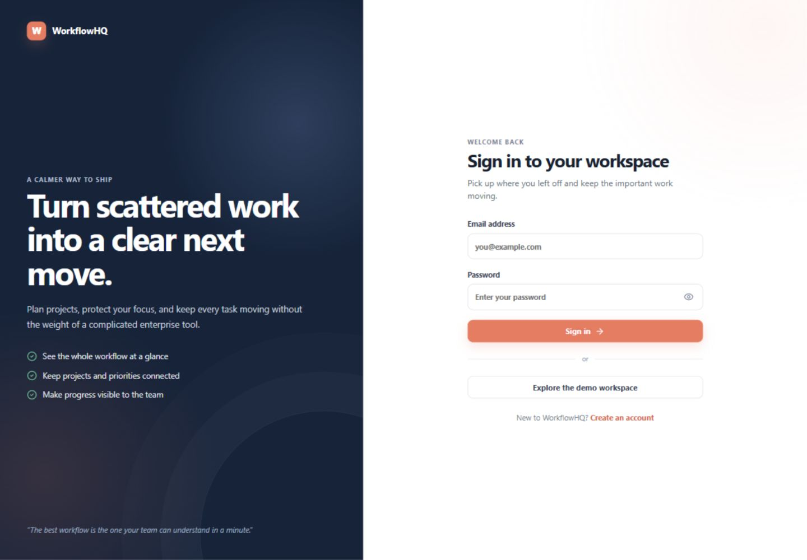
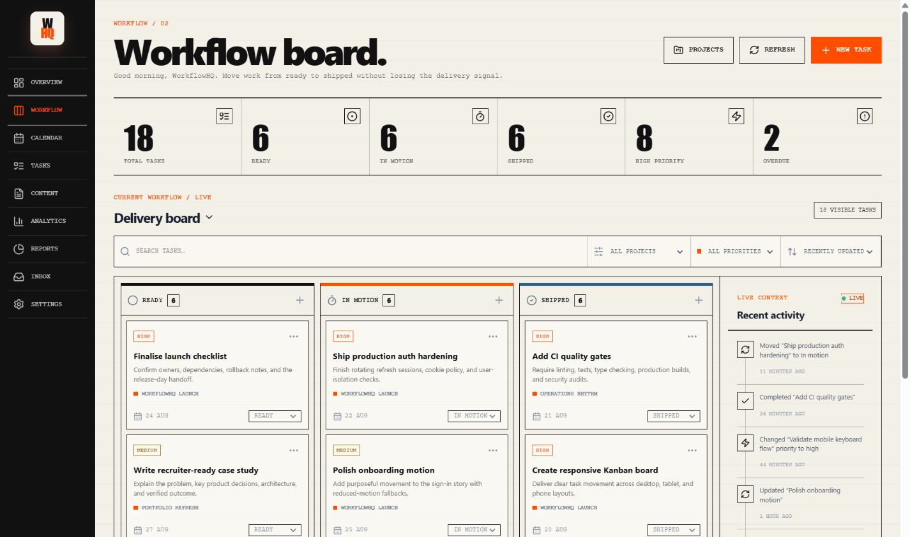
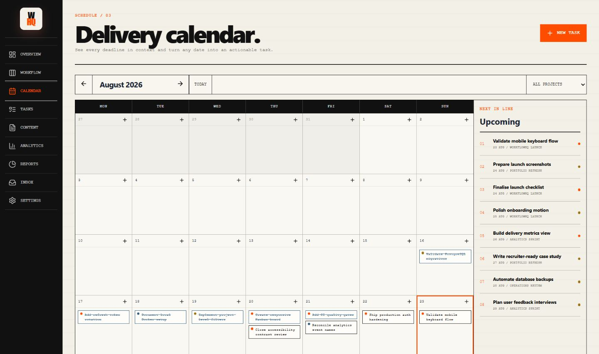
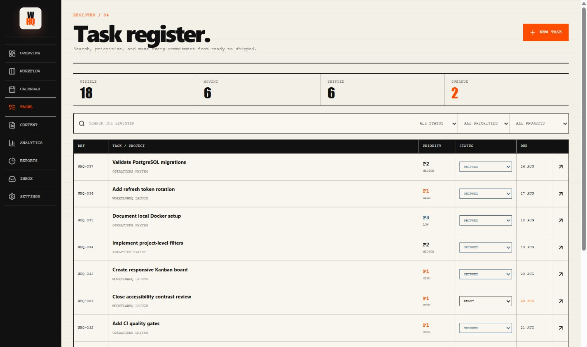
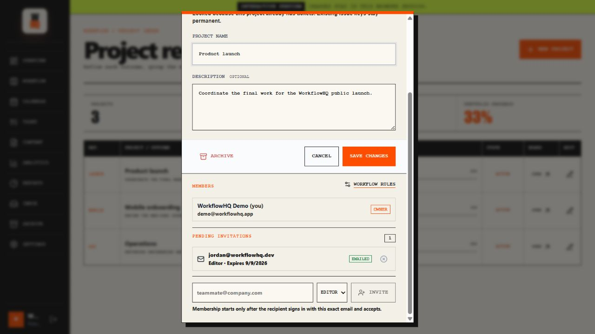
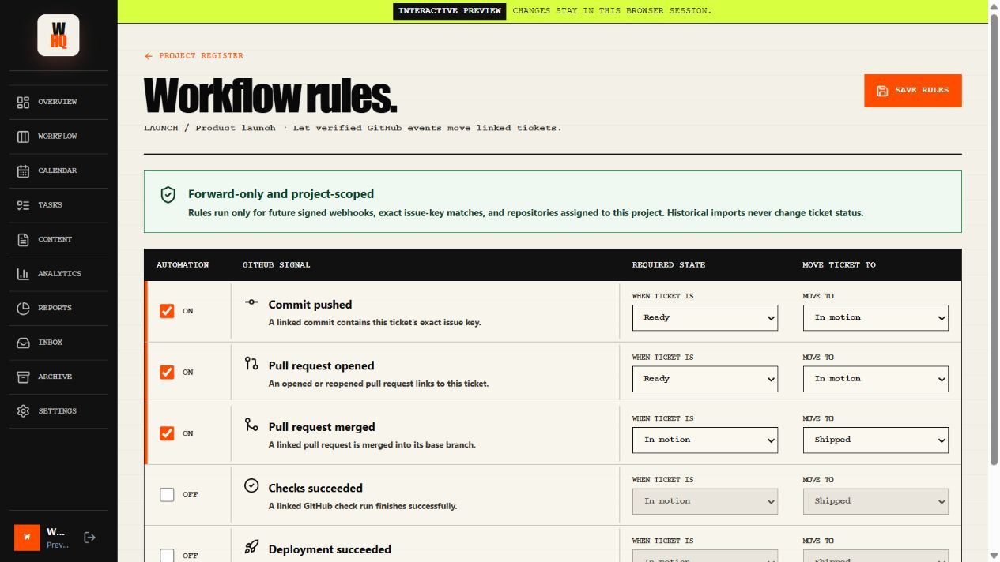
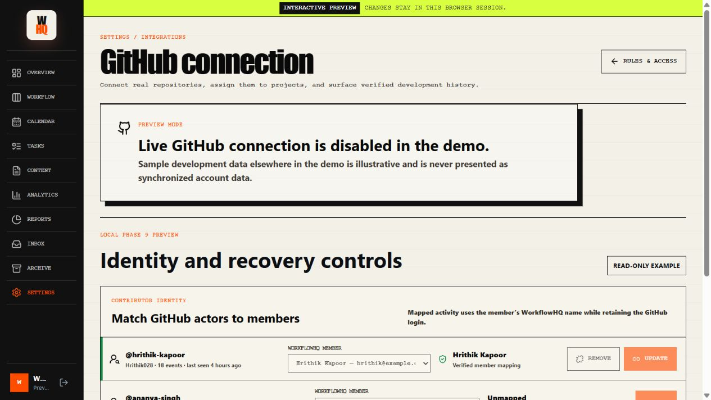
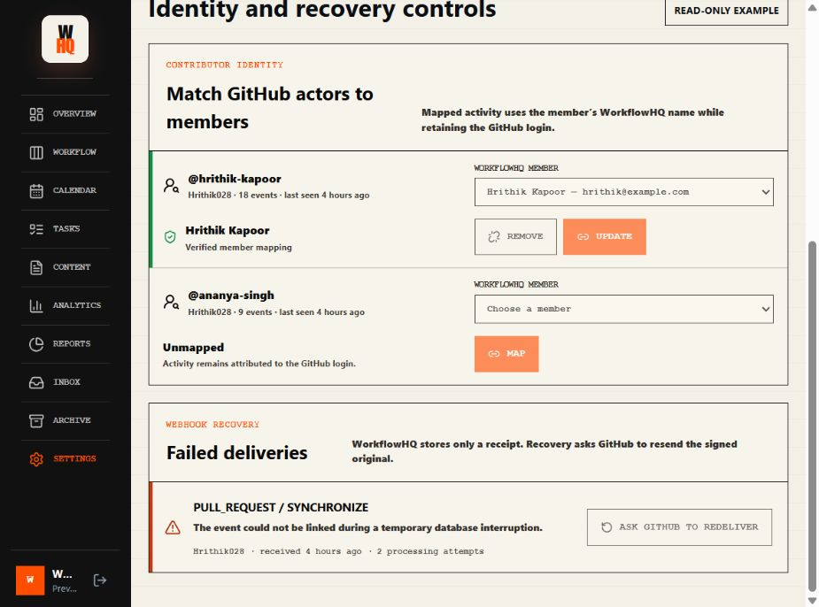
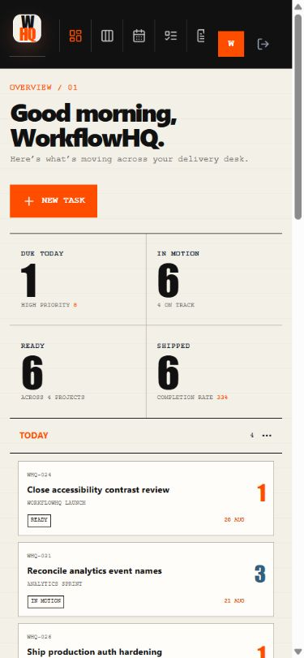
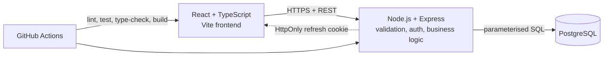

# WorkflowHQ

**Plan the work. See what’s moving. Ship what matters.** WorkflowHQ brings projects, tasks, deadlines, and delivery progress into one clear workspace.

## Live Demo

[Open WorkflowHQ](https://workflowhq-app.onrender.com/login)

Use the clearly labelled demo entry for sample data, or create an account to verify persisted projects and tickets. GitHub development signals remain unavailable until a repository is explicitly connected.

## Overview

The application combines a React TypeScript interface with an Express REST API and PostgreSQL. Users get a private editorial-style workspace with projects, a Kanban flow, a searchable task register, a deadline calendar, workflow statistics, and lightweight activity history.

## Product Preview


<details>
<summary>Explore the full interface</summary>

### Sign in



### Workflow board



### Projects


### Calendar



### Tasks



### Task editor


### Project invitations



### GitHub workflow rules



### GitHub identity and recovery operations





### Mobile overview



</details>

## Tech Stack

| Layer    | Technologies                          |
| -------- | ------------------------------------- |
| Frontend | React, TypeScript, Vite, Axios, CSS   |
| Backend  | Node.js, Express, Zod, JWT, bcrypt    |
| Database | PostgreSQL, raw SQL migrations        |
| Delivery | Docker Compose, Nginx, GitHub Actions |

## Key Features

- Short-lived access tokens with rotating refresh tokens in `HttpOnly` cookies
- User-owned projects and tasks with authorization enforced in every query
- Expiring project invitations with exact-email acceptance, owner revocation, and copy-link fallback
- Owner-configured GitHub rules that move exact-key tickets forward from verified webhook signals
- Contributor identity mapping and bounded GitHub webhook recovery without retaining raw payloads
- Kanban board with drag-and-drop and accessible status controls
- Searchable all-task register with inline status editing
- Month calendar with project filtering, upcoming work, and date-aware task creation
- Bounded pagination, search, project/priority filters, and sorting
- Dashboard counts for status, priority, and overdue work
- Focused activity history for important task and project changes
- Responsive loading, empty, success, and error states
- Integration tests for authentication, authorization, validation, CRUD, and queries

## Architecture



## Running Locally

The simplest path starts the frontend, API, and PostgreSQL together:

```bash
docker compose up --build
```

Open `http://localhost:4173`. The API health route is `http://localhost:5000/api/health`.

To load a presentation-ready workspace with four projects, eighteen tasks, and recent activity:

```bash
docker compose run --rm backend npm run seed:demo
```

Sign in with `demo@workflowhq.app` and `WorkflowHQ!2026`. The command resets only this local
demo account, so it is safe to rerun when you want a clean showcase workspace. Override the
`DEMO_USER_*` environment variables if you need different local credentials.

For development without Docker, use Node.js 22.13+ and PostgreSQL 16+:

```bash
# backend
cd backend
copy .env.example .env
npm ci
npm run migrate
npm run dev

# frontend, in a second terminal
cd frontend
copy .env.example .env
npm ci
npm run dev
```

The frontend development server runs at `http://localhost:5173`.

### Project invitation email

Project invitations work without an email provider: the project owner receives a secure link to
copy and send manually. To deliver that same link by email, configure these variables on the
**backend only**:

```env
APP_BASE_URL=https://your-frontend.example
INVITATION_EMAIL_PROVIDER=resend
INVITATION_FROM_EMAIL=WorkflowHQ <invites@your-verified-domain.example>
INVITATION_TTL_HOURS=168
RESEND_API_KEY=re_server_only_secret
```

Leave `INVITATION_EMAIL_PROVIDER=disabled` until the sending domain is verified. Raw invitation
tokens are never stored in PostgreSQL; only SHA-256 hashes are retained. A recipient must sign in
or register with the exact invited email before accepting, and project membership is created only
after acceptance.

### GitHub workflow automation

Project owners can open **Project register → Edit → Workflow rules** to control five repository
signals: commit pushed, pull request opened, pull request merged, checks succeeded, and deployment
succeeded. The safe defaults move Ready tickets to In motion on a linked commit or opened pull
request, and move In motion tickets to Shipped after a linked pull request is merged. Check and
deployment completion rules are disabled until an owner explicitly enables them.

Automation is intentionally constrained:

- Only future, signature-verified GitHub webhooks can move tickets; history imports are read-only.
- The repository must be assigned to the same WorkflowHQ project as the ticket.
- A branch, commit, or pull request must contain the ticket's exact issue key, such as `WHQ-42`.
- Rules can move a ticket forward only, and every run is idempotent and retained in the activity log.
- Project editors can still move tickets manually, but only project owners can change automation rules.

### Contributor identity and webhook recovery

The GitHub connection page lets an installation owner map an observed GitHub login to a member of
a project linked to that installation. A login cannot be mapped until it appears in verified
repository activity, the selected WorkflowHQ user must already belong to a linked project, and bot
accounts remain automation identities. The mapping is applied dynamically, so both existing and
future development history can show the member name without rewriting the imported GitHub record.

Failed webhook receipts are listed without raw request bodies or payload hashes. The installation
owner can ask GitHub to redeliver the original signed event during GitHub's three-day recovery
window. WorkflowHQ enforces a one-minute cooldown and a five-request cap for each delivery; normal
signature checks, deduplication, repository scope, and automation rules run again when GitHub sends
the event back.

### Assign the initial platform owner

After migrations have run and the owner has registered an account, assign the single platform
owner from a trusted backend shell:

```bash
cd backend
npm run owner:assign -- owner@example.com
```

The command demotes any previous owner to administrator, revokes affected sessions, and records the
recovery action. Future ownership transfers use the protected Settings screen and require the
current owner's password.

## Testing

```bash
node scripts/release-audit.mjs
cd backend && npm test
cd frontend && npm run typecheck && npm test && npm run build
```

Backend tests use an isolated PostgreSQL-compatible database and exercise the HTTP API. The frontend tests cover protected routing and core task interactions.

The complete developer-beta release procedure is documented in
[docs/developer-beta-release-checklist.md](docs/developer-beta-release-checklist.md). Security
boundaries and private reporting guidance are in [SECURITY.md](SECURITY.md).

To audit a configured database without changing it, run:

```bash
cd backend
npm run migrate:status
```

The command compares the checked-in SQL files with `schema_migrations`, reports every applied,
pending, or unknown migration, and exits unsuccessfully when the database and repository differ.
It never prints the configured database URL. CI runs this check after applying migrations, and the
backend container runs it before starting the API.

## Deployment

Both applications are containerised. Production requires a managed PostgreSQL database, HTTPS, a long random `JWT_SECRET`, the deployed frontend origin in `CORS_ORIGIN`, and `Secure` cross-site cookies when the frontend and API use different sites. Database TLS is controlled explicitly with `DATABASE_SSL`, and certificate verification remains enabled by default.

## Engineering Decisions

- Raw SQL keeps ownership rules and indexing decisions visible and interview-friendly.
- Refresh tokens are hashed in PostgreSQL and rotated instead of being exposed to JavaScript.
- Native drag-and-drop is paired with a status selector so task movement stays reliable on touch and keyboard workflows.
- A 100-item maximum page size prevents unbounded task responses.
- One CI workflow verifies both applications and runs migrations against PostgreSQL.

## Future Improvements

- Replace the product screenshots whenever the production interface changes materially.
- Add richer repository-health alerts and an operator-facing integration audit dashboard.
- Add password reset and session-management controls.
- Consider AI task breakdown only after the deployed core flow is stable.
