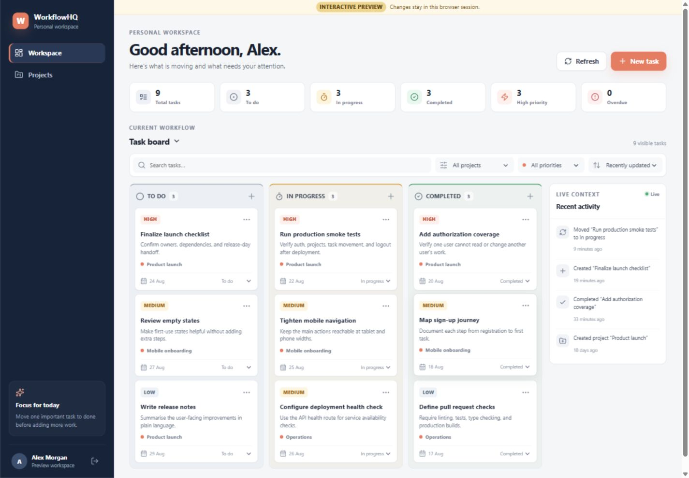
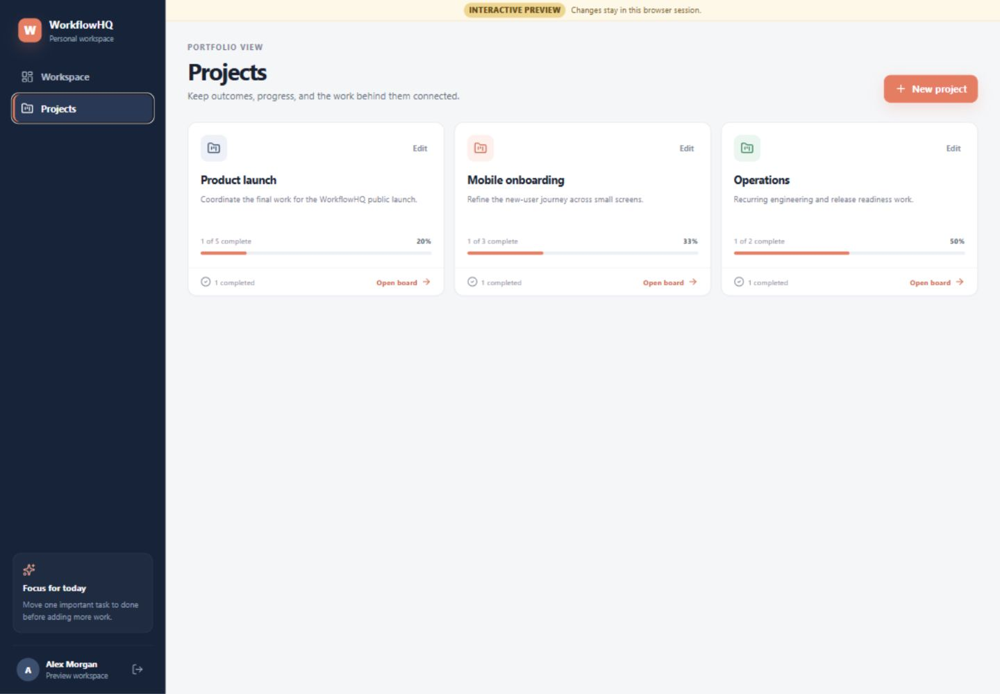
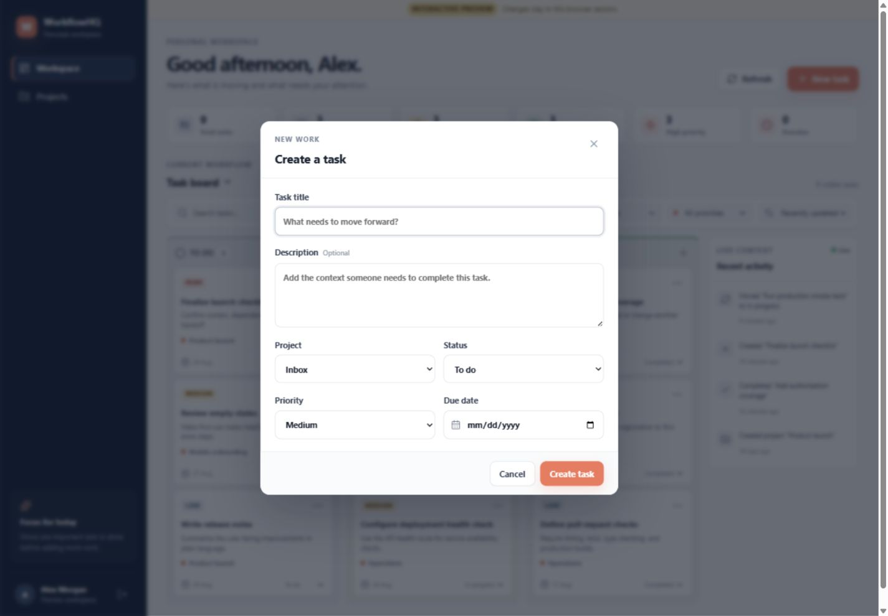
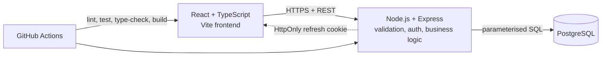

# WorkflowHQ

**Plan the work. See what’s moving. Ship what matters.** WorkflowHQ brings projects, tasks, deadlines, and delivery progress into one clear workspace.

## Live Demo

Public deployment will be added after the local production preview is approved.

## Overview

The application combines a React TypeScript interface with an Express REST API and PostgreSQL. Users get a private editorial-style workspace with projects, a Kanban flow, a searchable task register, a deadline calendar, workflow statistics, and lightweight activity history.

## Product Preview



<details>
<summary>More screens</summary>





</details>

## Tech Stack

| Layer    | Technologies                          |
| -------- | ------------------------------------- |
| Frontend | React, TypeScript, Vite, Axios, CSS   |
| Backend  | Node.js, Express, Zod, JWT, bcrypt    |
| Database | PostgreSQL, raw SQL migrations        |
| Delivery | Docker Compose, Nginx, GitHub Actions |

## Key Features

- Short-lived access tokens with rotating refresh tokens in `HttpOnly` cookies
- User-owned projects and tasks with authorization enforced in every query
- Kanban board with drag-and-drop and accessible status controls
- Searchable all-task register with inline status editing
- Month calendar with project filtering, upcoming work, and date-aware task creation
- Bounded pagination, search, project/priority filters, and sorting
- Dashboard counts for status, priority, and overdue work
- Focused activity history for important task and project changes
- Responsive loading, empty, success, and error states
- Integration tests for authentication, authorization, validation, CRUD, and queries

## Architecture



## Running Locally

The simplest path starts the frontend, API, and PostgreSQL together:

```bash
docker compose up --build
```

Open `http://localhost:4173`. The API health route is `http://localhost:5000/api/health`.

To load a presentation-ready workspace with four projects, eighteen tasks, and recent activity:

```bash
docker compose run --rm backend npm run seed:demo
```

Sign in with `demo@workflowhq.local` and `WorkflowHQ!2026`. The command resets only this local
demo account, so it is safe to rerun when you want a clean showcase workspace. Override the
`DEMO_USER_*` environment variables if you need different local credentials.

For development without Docker, use Node.js 22.13+ and PostgreSQL 16+:

```bash
# backend
cd backend
copy .env.example .env
npm ci
npm run migrate
npm run dev

# frontend, in a second terminal
cd frontend
copy .env.example .env
npm ci
npm run dev
```

The frontend development server runs at `http://localhost:5173`.

## Testing

```bash
cd backend && npm test
cd frontend && npm run typecheck && npm test && npm run build
```

Backend tests use an isolated PostgreSQL-compatible database and exercise the HTTP API. The frontend tests cover protected routing and core task interactions.

## Deployment

Both applications are containerised. Production requires a managed PostgreSQL database, HTTPS, a long random `JWT_SECRET`, the deployed frontend origin in `CORS_ORIGIN`, and `Secure` cross-site cookies when the frontend and API use different sites. Database TLS is controlled explicitly with `DATABASE_SSL`, and certificate verification remains enabled by default.

## Engineering Decisions

- Raw SQL keeps ownership rules and indexing decisions visible and interview-friendly.
- Refresh tokens are hashed in PostgreSQL and rotated instead of being exposed to JavaScript.
- Native drag-and-drop is paired with a status selector so task movement stays reliable on touch and keyboard workflows.
- A 100-item maximum page size prevents unbounded task responses.
- One CI workflow verifies both applications and runs migrations against PostgreSQL.

## Future Improvements

- Deploy the approved build and add verified live URLs and screenshots.
- Add password reset and session-management controls.
- Consider AI task breakdown only after the deployed core flow is stable.
