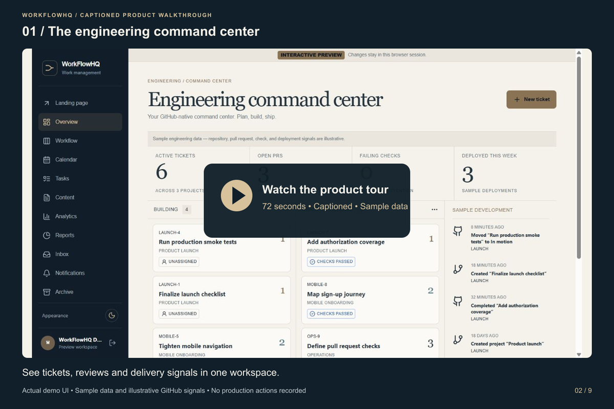
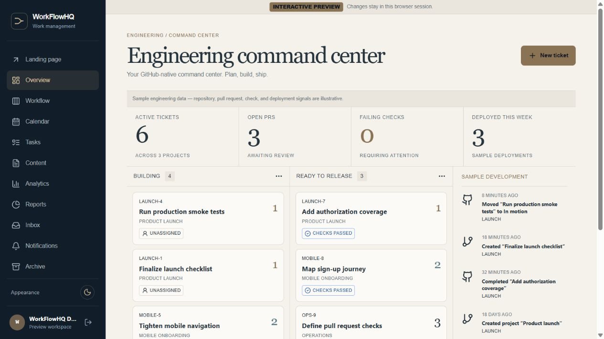
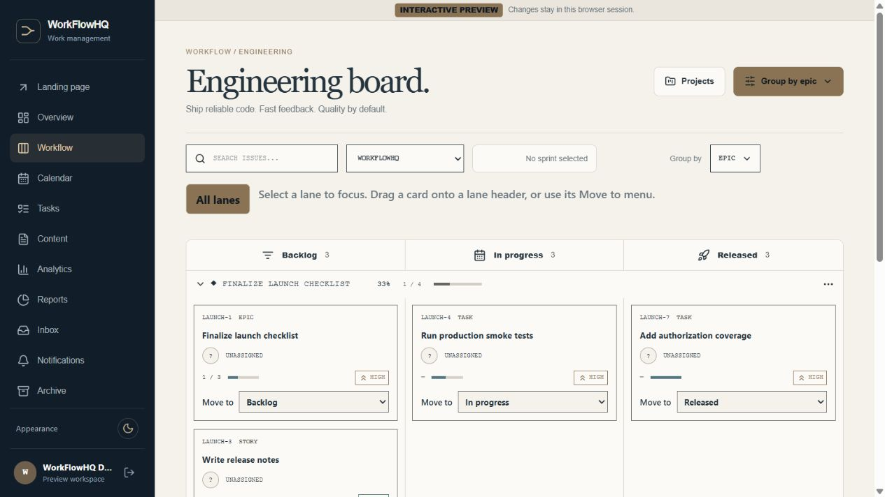
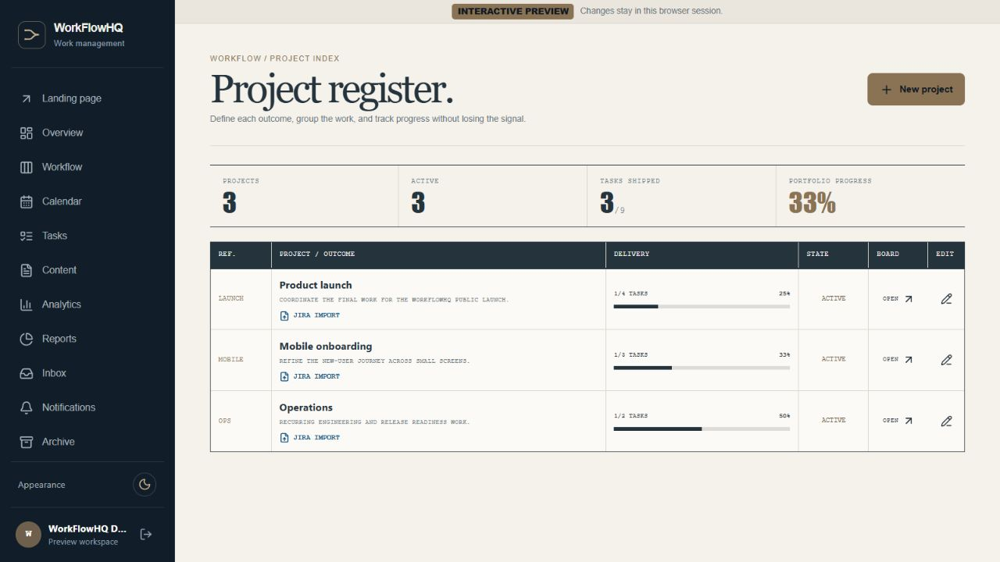
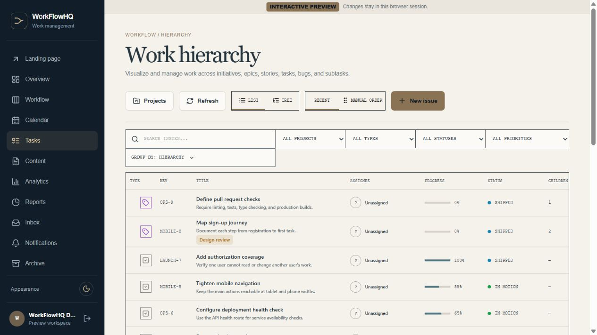
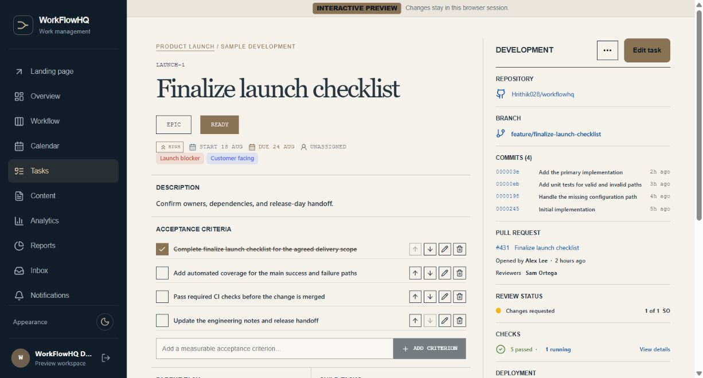
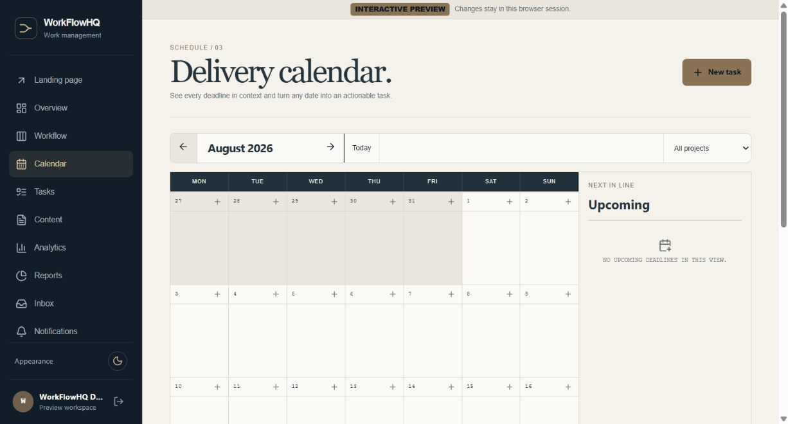
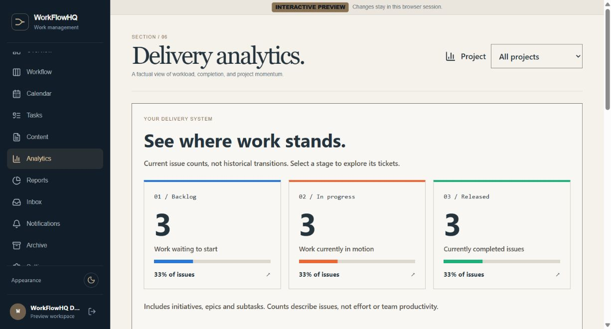
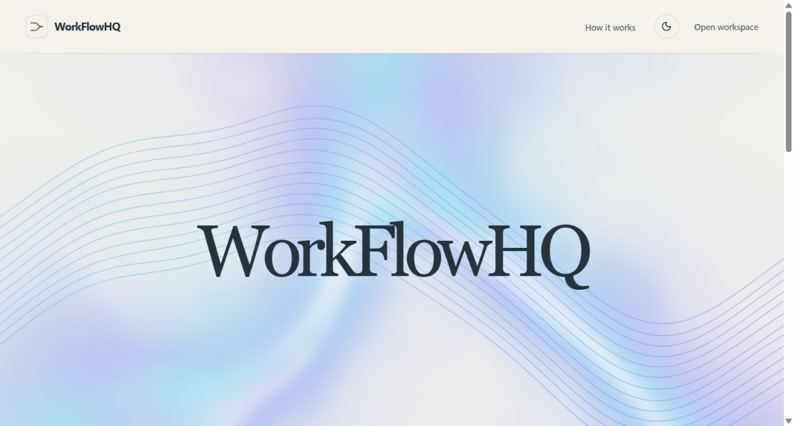

# WorkflowHQ

### Plan the work. Follow the code. Approve the AI.

WorkflowHQ connects project planning with the engineering work that delivers it. Organize tickets and acceptance criteria, follow repository activity, and review AI proposals before anything changes.

[Try the application](https://workflowhq-app.onrender.com/) · [Watch the walkthrough](docs/media/workflowhq-demo.mp4) · [Run locally](#run-locally) · [Architecture](#architecture)

> **Developer beta.** Core planning, GitHub integration, governed AI planning and action review are merged into `master`. Optional integrations need backend configuration. The feature/release table below separates merged code from pending work; it does not certify the current production deployment.

## A quick product tour

[](docs/media/workflowhq-demo.mp4)

**72-second captioned walkthrough** · No audio required · [Transcript](docs/media/demo-transcript.md)

The video is an edited walkthrough of actual browser captures, plus explanatory diagrams—not a live recording of production actions. Screens use the built-in, session-only demo. Ticket names, people, counts and GitHub signals are illustrative, not evidence of real repository events. Clicking the thumbnail opens the MP4; GitHub may offer a download rather than an inline player.



## What you can do

| Workflow                           | What WorkflowHQ adds                                                                                                                                                                               |
| ---------------------------------- | -------------------------------------------------------------------------------------------------------------------------------------------------------------------------------------------------- |
| **Plan with context**              | Projects, initiatives, epics, stories, tasks, bugs and subtasks; parent/child work; editable acceptance criteria, priorities, owners and dates.                                                    |
| **Keep delivery visible**          | Board movement with accessible status controls, a searchable hierarchy, deadline calendar, archive/restore and project progress.                                                                   |
| **Connect the repository**         | Install a GitHub App, grant repository access, then explicitly select and assign repositories to WorkflowHQ projects. Explore synchronized commits, pull requests, checks and deployment activity. |
| **Link code to a ticket**          | Put an exact issue key such as `WHQ-42` in a branch, commit or PR. Verified future webhooks can apply owner-configured forward-only status rules. History imports do not move tickets.             |
| **Plan with your own AI provider** | Personal encrypted credentials for OpenAI, Anthropic or Google Gemini. Budget defaults, selectable approved models, bounded ticket/GitHub context, evidence labels and duplicate-title warnings.   |
| **Review before writing**          | Creation proposals and bounded ticket/criteria actions pass schema, permissions and version checks. Human approval, one-time approvals, transactions and idempotency protect application.          |
| **Work with a team**               | Project roles and expiring invitations, contributor identity mapping, comments, activity and in-app notifications. Platform ownership is separate from project ownership.                          |
| **Start from existing work**       | Preview and import a one-time Jira CSV export. Ongoing Jira synchronization is intentionally deferred.                                                                                             |

Analytics describe **current issue counts and last-updated completion trends**, not measured cycle time, historical stage transitions or developer productivity scores.

<details>
<summary><strong>Explore the interface — real captures, sample data</strong></summary>

### Workflow board



### Project register



### Ticket hierarchy



### Acceptance criteria and development context



### Delivery calendar



### Delivery analytics



### Landing page



</details>

## Architecture

One React application, a modular Express API and PostgreSQL. Authorization and mutations stay on the server; external services enter through explicit integration boundaries.


[Architecture and editable Mermaid diagrams](docs/architecture.md)

### AI assists; the user decides


Generation is read-only. Approved actions use the same domain rules as manual edits. Existing-ticket versions are checked again at apply time; a stale or unauthorized plan fails rather than silently overwriting work. Permanent ticket deletion is not an AI action.

The planner sends bounded, explicitly selected ticket and synchronized GitHub metadata—not repository source files, raw webhook bodies, environment variables or installation secrets. Credentials are decrypted only for the backend provider request and are never returned to the browser.

## Engineering and security boundaries

- Short-lived access tokens; hashed, rotating refresh tokens in `HttpOnly` cookies; active-session controls.
- Optional email verification and password recovery. TOTP setup includes QR codes and single-use recovery codes; MFA protects password resets and MFA changes, **not every normal sign-in**.
- Server-side project authorization, parameterized SQL, validated payloads, trusted-origin checks and tiered rate limits.
- GitHub signature verification, repository/project scope checks, delivery deduplication and bounded redelivery.
- AES-256-GCM credential vault, fixed provider endpoints, mandatory platform AI policy when planning is enabled, approved-model controls and usage limits.
- Backend HTTP integration tests, frontend component tests, real-PostgreSQL migration/transaction checks, lint/type/build CI and a source release audit.

These are implemented controls, not a claim of independent security certification. See [SECURITY.md](SECURITY.md), [credential rotation](docs/ai-credential-key-rotation.md) and the [release checklist](docs/developer-beta-release-checklist.md).

## Feature and release state

Checked against `origin/master` at `902e618` on **6 October 2026**. A feature branch existing or being merged into another feature branch is not the same as shipping it to `master`.

| Area                                                                                  | State                                                                           |
| ------------------------------------------------------------------------------------- | ------------------------------------------------------------------------------- |
| Core projects/tickets/criteria, calendar, archive/restore, analytics                  | Merged                                                                          |
| GitHub App connection, repository activity, identity/recovery and workflow automation | Merged; requires GitHub App configuration                                       |
| AI provider vault, conversations, proposals, action executor and governance           | Merged; requires backend secrets and a user's provider credential               |
| One-time Jira CSV import, in-app notifications, custom labels/manual transitions      | Merged                                                                          |
| Sustained-navigation-only loading indicator                                           | Merged in PR #75                                                                |
| Roadmaps and cycle-safe dependencies; additional ordered stages                       | Present in local/feature-branch work; not in the checked `master` revision      |
| Multi-workspace management, isolation hardening and related UI fixes                  | Local/feature-branch release work; rollout review and migrations still required |
| Jira live synchronization                                                             | Deferred                                                                        |

Workspace isolation, roadmaps and additional stages are separate release work. Review [the release checklist](docs/developer-beta-release-checklist.md) before enabling new capabilities; local tests do not certify a production deployment.

## Run locally

### Explore without a database

```bash
cd frontend
npm ci
npm run dev:demo
```

Open the URL Vite prints and use the demo entry. This mode uses sample data and browser-session changes; it does not test persistence, real webhooks or paid AI calls.

### Run the full stack

```bash
docker compose up --build
```

Open [localhost:4173](http://localhost:4173). API health: [localhost:5000/api/health](http://localhost:5000/api/health).

Node.js **22.13+** and PostgreSQL **16+** are required for development without Docker. The [developer guide](docs/developer-guide.md) covers separate frontend/backend startup, local demo seeding, environment variables, invitations, MFA, AI credentials, GitHub automation and platform-owner recovery.

**Never put GitHub private keys, provider vault keys, mail credentials or database credentials in frontend environment variables.**

## Verify a change

Run each section from the repository root or the named subdirectory:

```bash
node scripts/release-audit.mjs

cd backend
npm run lint
npm test
npm run migrate:status

cd ../frontend
npm run lint
npm run typecheck
npm test
npm run build
```

Migration status requires a configured database. Fast backend tests use PostgreSQL-compatible test infrastructure; they do not replace the real PostgreSQL and integration checks in the release procedure. Optional external integrations need their own controlled end-to-end test.

## Stack and repository

| Layer                          | Technology / location                                                             |
| ------------------------------ | --------------------------------------------------------------------------------- |
| Interface                      | React, TypeScript, Vite, Axios — `frontend/src`                                   |
| API and integration boundaries | Node.js, Express, Zod, JWT, bcrypt — `backend/src`                                |
| Persistence                    | PostgreSQL, explicit SQL migrations — `backend/migrations`                        |
| Delivery                       | Docker Compose, Nginx, GitHub Actions — `docker-compose.yml`, `.github/workflows` |
| Operations and QA              | `docs`, `backend/tests`, frontend colocated tests, `scripts`                      |

## Documentation

- [Setup and integration configuration](docs/developer-guide.md)
- [Architecture and trust boundaries](docs/architecture.md)
- [GitHub App implementation guide](docs/github-app-implementation-plan.md)
- [Jira CSV import](docs/jira-import.md)
- [AI action review testing](docs/phase-07-action-review-testing.md)
- [Backup and restore](docs/database-backup-restore-runbook.md)
- [Developer-beta release gates](docs/developer-beta-release-checklist.md)
- [Showcase provenance and rebuild instructions](docs/media/README.md)

Built to keep planning, repository evidence and human-approved AI changes in one understandable workflow.
