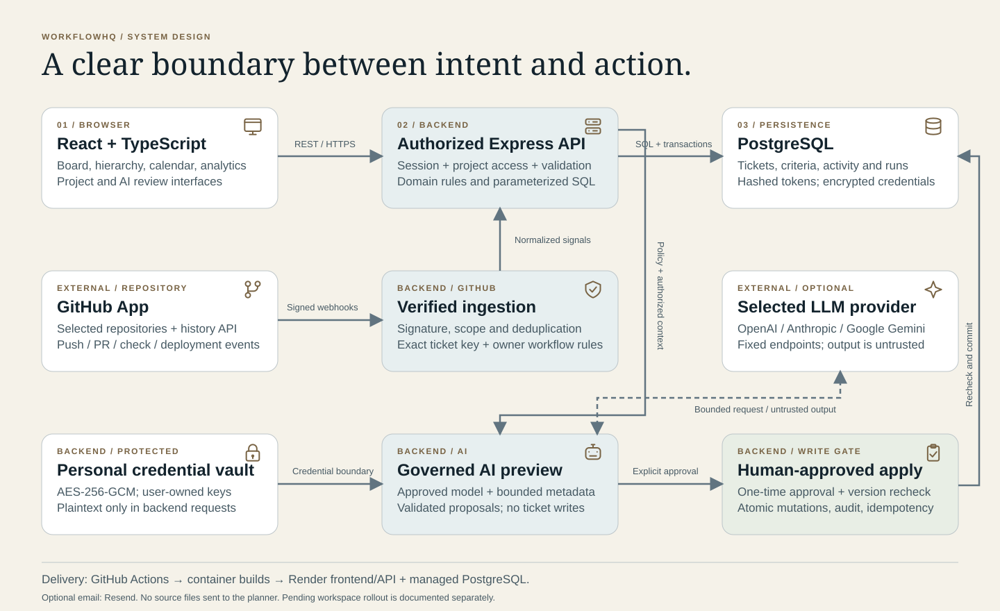
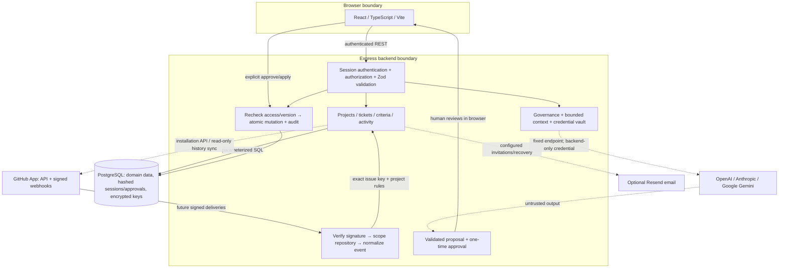
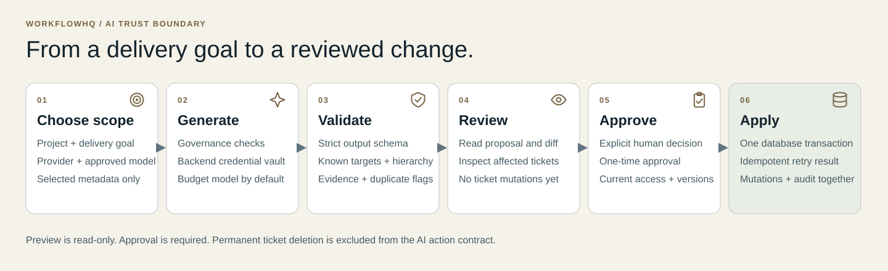

# WorkflowHQ architecture

WorkflowHQ is a modular Express application, a React client and PostgreSQL. These diagrams
describe the merged product architecture, not an independently audited production topology.
Optional providers require configuration. Pending workspace isolation is documented separately.



## System flow — editable source



## AI approval boundary



```mermaid
sequenceDiagram
  actor User
  participant UI as React client
  participant API as Authorized Express API
  participant LLM as Selected provider
  participant DB as PostgreSQL
  User->>UI: Select project, provider/model and context
  UI->>API: Generate proposal
  API->>API: Check governance; build bounded metadata
  API->>LLM: Request with decrypted user-owned credential
  LLM-->>API: Untrusted structured output
  API->>API: Validate schema, hierarchy and known targets
  API->>DB: Store proposal/run metadata and approval hashes
  API-->>UI: Read-only proposal for review
  User->>UI: Review and explicitly approve
  UI->>API: Apply reviewed proposal + idempotency key
  API->>DB: Lock/recheck access, versions and approval
  API->>DB: Commit mutations, audit and approval consumption atomically
  API-->>UI: Result (or rejection with no partial writes)
```

Generation does not change tickets. Current generated update actions emit one field per action;
assignment/sprint requests require manual editing until their generation context is integrated.
The executor supports a bounded contract, not arbitrary commands or autonomous code execution.

## Persistence and trust

- Project access is checked on the server, not trusted from frontend visibility.
- SQL makes ownership and mutation boundaries explicit. No database RLS claim is made.
- Refresh tokens and one-time approvals are hashed; provider credentials are authenticated ciphertext.
- Provider credentials are personal. Neither API responses nor conversations contain plaintext keys.
- GitHub deliveries are verified, scoped and deduplicated. Historical import is read-only;
  future exact-key events can move tickets forward under project-owner rules.
- User-controlled/repository text is untrusted context, not elevated planner instructions.
- Conversation detail retention is bounded; minimal non-secret audit metadata remains.
- Pending workspace changes add roots and scoped constraints; they need migration/rollout review.

## Delivery

GitHub Actions runs the configured source audit, lint/tests/type/build and database checks.
Docker builds the application containers. The documented deployment uses Render for frontend/API
and managed PostgreSQL; database TLS verification is enabled by default. There is no claim of a
queue fleet, distributed tracing service, Kubernetes cluster or automatic production deployment
verification. See the release checklist for actual deployment gates.

## Source map

| Concern                             | Source boundary                                                      |
| ----------------------------------- | -------------------------------------------------------------------- |
| API routing and middleware          | `backend/src/app.js`, `backend/src/middleware`                       |
| Manual and AI ticket mutations      | `backend/src/lib/taskMutationService.js`                             |
| AI policy and credential protection | `backend/src/lib/aiGovernance.js`, `aiCredentialVault.js`            |
| Repository sync and event ingestion | `backend/src/lib/githubRepositorySync.js`, `githubWebhookService.js` |
| Data changes                        | `backend/migrations`                                                 |
| UI, providers and project views     | `frontend/src/components`, `frontend/src/pages`                      |

Diagrams are editable SVGs with native Mermaid equivalents here. Screenshots and video provenance
are recorded in [the media notes](media/README.md).
